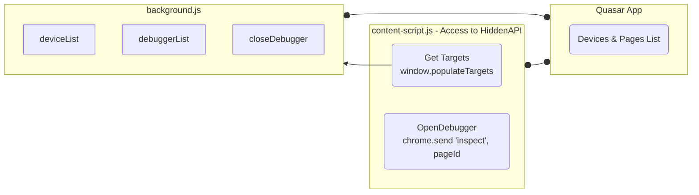
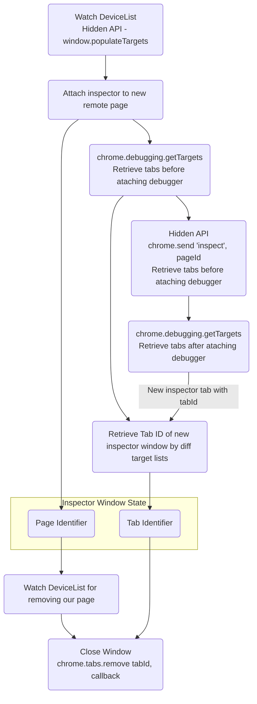

## Arch

```mermaid
flowchart RL
    
    subgraph content [content-script.js - Access to HiddenAPI]
        populateTargets(Get Targets\nwindow.populateTargets)
        openDebugger(OpenDebugger\nchrome.send 'inspect', pageId)
        
    end
    subgraph background [background.js]
        deviceList
        debuggerList
        openDebugger
        closeDebugger
    end
    subgraph app [Quasar App]
        ui(Devices & Pages List)
    end

    app o--o background
    app o--o content
    populateTargets --> background
```

## Inspector Window Flow
### Legenda
- **HiddenAPI** - we inject `content-script.js` into `chrome://inspect` to access hidden api (getting remote device list and open inspector)

```mermaid
flowchart TB
    lookDeviceList(Watch DeviceList\nHidden API - window.populateTargets) -->
    attachByPageId(Attach inspector to new remote page) -->
    getTargetsBefore(chrome.debugging.getTargets\nRetrieve tabs before ataching debugger) -->
    inspectCall(Hidden API\nchrome.send 'inspect', pageId\nRetrieve tabs before ataching debugger) -->
    getTargetsAfter(chrome.debugging.getTargets\nRetrieve tabs after ataching debugger)
    retrieveTabId(Retrieve Tab ID of new inspector window by diff target lists) 
    detattachByPageId(Watch DeviceList for removing our page) -->
    closeWindow(Close Window\nchrome.tabs.remove tabId, callback) 
    subgraph state [Inspector Window State]
        pageId(Page Identifier)
        tabId(Tab Identifier)
    end

    getTargetsBefore --> retrieveTabId
    getTargetsAfter -->|New inspector tab with tabId| retrieveTabId
    retrieveTabId --> tabId

    attachByPageId --> pageId
    pageId --> detattachByPageId
    tabId --> closeWindow
```